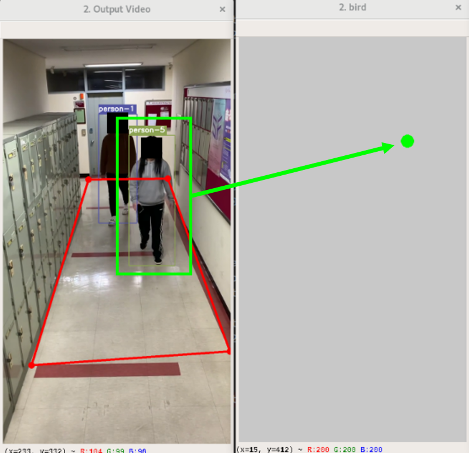

DeepSORT with Biry Eye View (BEV)
 ====================
 # 1. Bird Eye View & Bottom points
  __*BEV는 기하학적 변환으로 위에서 아래로 내려다보는 top-view를 말한다.*__
  
  여러 대의 CCTV에서 높이와 각도 때문에 동일한 사람을 매칭시키는데 어려움이 있으며, 관측자에게도 보다 나은 시각적 결과를 제공하기 위해 검출된 여러 CCTV들에 대해 BEV를 적용함.
 
 __Object detection에서 획득한 바운딩 박스로부터 하단 좌표(bottom point)를 구하고 BEV에 적용함.__
 
``` python
def get_transformed_points(boxes, prespective_transform):
    bottom_points = []
    # print('boxes : ',boxes)
    for box in boxes:
        # print('1. box : ',box)
        pnts = np.array([[[int((box[0] + box[2]) * 0.5), int((box[1] + box[3]) * 0.5)]]], dtype="float32")
        # print('2. pnts : ', pnts)
        bd_pnt = cv2.perspectiveTransform(pnts, prespective_transform)[0][0]
        # print('prespective_transform : ', prespective_transform)
        pnt = [int(bd_pnt[0]), int(bd_pnt[1])]
        # print('3. pnt : ',pnt)
        bottom_points.append(pnt)

    return bottom_points
``` 


``` python
def bird_eye_view(bottom_points):
    w = 720
    h = 1280

    red = (0, 0, 255)
    green = (0, 255, 0)
    yellow = (0, 255, 255)
    white = (200, 200, 200)

    # scale_w = 0.3125
    # scale_h = 1.0
    scale_w, scale_h = get_scale(w, h)
    blank_image = np.zeros((640,360, 3), np.uint8)
    blank_image[:] = white

    for i in bottom_points:
        blank_image = cv2.circle(blank_image, (int(i[0] * scale_w), int(i[1] * scale_h)), 5, green, 10)
    return blank_image
```



# 2. Object Detection and Tracking
  최근 다중 물체 인식 및 추적 성능이 좋다고 알려진 딥러닝 알고리즘에는 __*YOLO, Detectron, Alphapose, DeepSORT*__ ..등 여러 종류의 알고리즘이 있다.
  
  물체 추적 시 두 물체의 겹침이 발생하면 물체들을 나누어 인식하여 매칭시켜주는 기능(identity Matching)이 정확히 이뤄지지 않는 문제가 발생하는데 이를 해결하기 위해, 두 물체 사이의 유사성을 판단할 수 있는 방법을 사용하여 문제를 극복하고자 함.
  
  -- image --
  
> ### 2.1 선택된 DeepSORT의 구조
  DeepSORT는 YOLO V4를 이용하여 Object Detection을 하는 것과 함께, Multi-Object Tracking을 지원하는 알고리즘임. 트래킹의 경우는 기본적으로 __Kalman Filter__ 를 사용하고 있으며, __deep appearance descriptor__ 를 이용하여 물체의 유사도를 측정하고, __Hungarian Assignment algorithm__ 을 이용하여 여러 프레임에 걸쳐 나타나는 물체들의 __*identity matching*__ 을 지원하고 있음.
  
  그러나, DeepSORT 알고리즘의 Kalman Filter와 identity matching은 __단일 카메라__ 상에서 보이는 이미지에서만 가능하고, 카메라 외부와의 연결 및 다른 여러 대의 카메라에서의 데이터는 융합하지는 못함.
  
# 3. Multi cam
  단일 카메라가 아닌 2대 이상의 카메라를 사용함.
  
  객체 검출 및 추적 시 __사람 간의 가림 또는 중첩 현상__ 으로 사각지대가 발생하였을 때 멀티 카메라 상황에서는 다른 카메라가 이러한 사각지대를 채워줌으로 검출 및 추적 성능을 높일 수 있을 것임.
   
   
# 4. Future work... (Similarity)
  멀티 캠 상황에서, 각 카메라에서 추출된 물체의 위치 정보를 하나의 공간에 투사하고 서로 연결시키기 위해서 BEV를 통해 변환하고, BEV 과정을 통해 변환된 좌표들 사이의 유사성(Similarity)을 이용하여 Remapping을 시행할 예정.
  
  유사도 측정 방법으로는 식 1과 같은 Euclidean distance를 사용할 예정.
  
  각 카메라들의 위치를 고려하여 1번 카메라의 경우 식 2와 같이, 2번 카메라의 경우 식 3과 같이 매칭을 진행. 매칭이 완료된 좌표들은 전체 BEV 이미지와 같이 각 카메라 간의 중첩지역에서 객체가 검출될 시 Euclidean distance를 측정하여 각 카메라에서 추적되는 같은 ID를 가진 물체들과 remapping 시켜줌으로써 물체 간의 중첩으로 인해 발생하는 객체 검출 및 추적 실패를 방지할 수 있음.


#### References  

   Huge shoutout goes to hunglc007 and nwojke for creating the backbones of this repository:
  * [tensorflow-yolov4-tflite](https://github.com/hunglc007/tensorflow-yolov4-tflite)
  * [Deep SORT Repository](https://github.com/nwojke/deep_sort)
